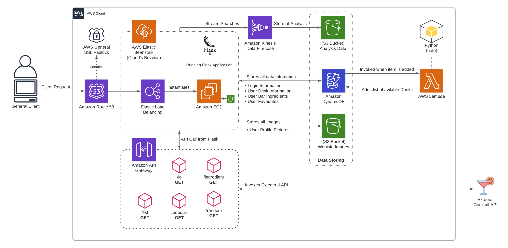

# Oland's Bevvies: Cocktail Website

## Cloud Computing - COSC2626: Assignment 3
**RMIT University Melbourne**

**Members**
- [S3656903](willboland0@gmail.com) Will Boland

**Credits**
- [The CocktailDB](https://www.thecocktaildb.com/api.php)
- [Bootstrap](https://getbootstrap.com/)

# Table of Contents 
- [Introduction](#introduction)
- [System Architecture](#system-architecture)
- [Implementation](#implementation)
    - [AWS Configuration](#aws-configuration)
    - [DynamoDB](#dynamodb)
    - [S3 Buckets](#s3-buckets)
    - [Lambda Function](#lambda)
    - [API Gateway](#api-gateway)
    - [Kinesis Firehose](#kinesis-firehose)
    - [Route53](#route53)
    - [Envoriment Variables](#env)
    - [Deployment](#deployment)

---
# Introduction
Oland’s Bevvies is a web-based application for finding new and exciting cocktails based off current
ingredients. This application takes advantages of multiple cloud computing services offered by
Amazon Web Service (AWS). AWS is the most popular cloud service provider in the world offering
over 150 different services with a pay-as-you-go pricing model. This application also integrates third
party APIs for a seamless experience. 

This application incorporates a verity of different features for users, including a dashboard where
users can save different drinks they have previously made. The application allows users to input their
ingredients in the bar sections based on their current kitchen, it will then calculate what drinks can
be made with those ingredients and display these on the dashboard. Users can also use the explore
section to find new cocktails and then add the remaining ingredients to their shopping list. 

---
# System Architecture

